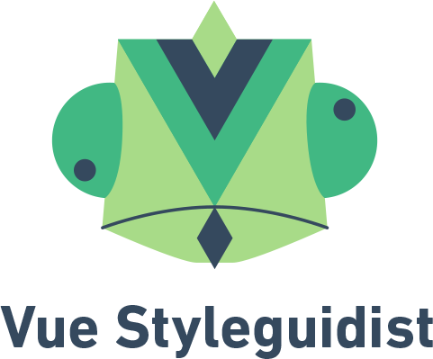

    

**Isolated Vue component development environment with a living style guide**

## Documentation

Docs are available at https://vue-styleguidist.github.io/ - we are still working on refining it and contributions are welcome!

## Packages

[vue-docgen-api](packages/vue-docgen-api) will parse your vue components and load their documentation in a Javascript object

[vue-styleguidist](packages/vue-styleguidist) will take the results of vue-docgen-api and create a good looking site to play with your components

[vue-cli-plugin-styleguidist](packages/vue-cli-plugin-styleguidist) will configure styleguidist to work smoothly with [vue-cli 3](https://cli.vuejs.org/guide/)

## Contributing

Please see [contributing guide](https://github.com/vue-styleguidist/vue-styleguidist/blob/master/.github/CONTRIBUTING.md).

## Authors and license

[Artem Sapegin](http://sapegin.me), [Rafael Escala](https://github.com/rafaesc), [Bart Ledoux](https://github.com/elevatebart), [react-styleguidist contributors](https://github.com/styleguidist/react-styleguidist/graphs/contributors) and [vue-styleguidist contributors](https://github.com/vue-styleguidist/vue-styleguidist/graphs/contributors). Thanks to the team of react-styleguidist for the amazing tool.

We work on this project because we love the open source community and learn new things.

- Rafael: You can buy me a cup of coffee :) 
- Bart: Send me money to make chameleon stickers. I promise I will send you one if you donate. 

Logo by [Benjamin Cognard](https://twitter.com/benbnur).

## License

[MIT License](https://github.com/vue-styleguidist/vue-styleguidist/blob/master/LICENSE)
