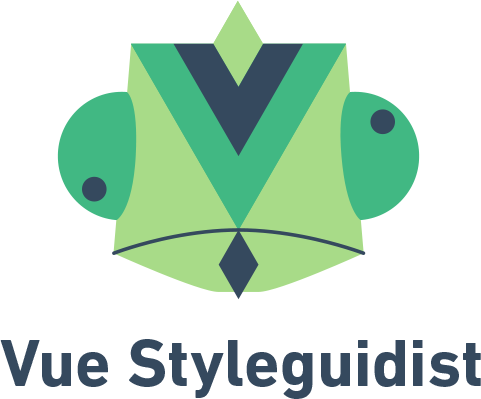

    

    **Isolated Vue component development environment with a living style guide**

    

    
    

    
    
    
    
    
  

## Documentation

Docs are available at https://vue-styleguidist.github.io/ - we are still working on refining it and contributions are welcome!

## Contributing

Please see [contributing guide](https://github.com/vue-styleguidist/vue-styleguidist/blob/master/.github/CONTRIBUTING.md).

## License

[MIT](https://github.com/vue-styleguidist/vue-styleguidist/blob/master/LICENSE)